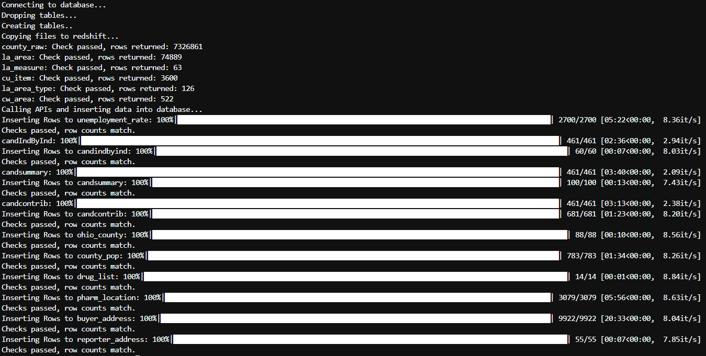

<p align="center">
   
</p>
<p align = "center">
Photo by <a href="https://unsplash.com/@towfiqu999999?utm_source=unsplash&utm_medium=referral&utm_content=creditCopyText">Towfiqu barbhuiya</a> on <a href="https://unsplash.com/s/photos/pills?utm_source=unsplash&utm_medium=referral&utm_content=creditCopyText">Unsplash</a>
</p>

# ohio-opioid-analysis-database
---

This project and repository is designed to gather data from several sources thought to be relevant to analyzing the prescription of opioids in Ohio between the years of 2006 and 2014. The over-consumption, addiction and unfortunate fatal overdoses due to opioid abuse is a problem in the United States. The problem is so pervasive that it is often referred to as the "opioid epidemic" and has received national attention and even been declared [a public health emergency by the Department of Health and Human Services (HHS)](https://www.hhs.gov/opioids/about-the-epidemic/index.html). Differences in opioid prescription rates and overdoses may differ between areas of the country and even areas of an individual state. In this project, I gather data at the county level for the state of Ohio, transform it, and load it to a relational database that can be used in analysis. Pairing the information from this database with other data sources can lead to more insights over time.

Reference: https://www.hhs.gov/opioids/about-the-epidemic/index.html

_This project also served as my capstone project for the [Data Engineer Nanodegree Program by Udacity](https://www.udacity.com/course/data-engineer-nanodegree--nd027?utm_source=gsem_brand&utm_medium=ads_r&utm_campaign=12712960793_c&utm_term=124530938590&utm_keyword=data%20engineer%20nanodegree_e&gclid=CjwKCAiAv_KMBhAzEiwAs-rX1PQVZVeGVHV9K34bBP2kNb1yqeq2WbRh4vt4oG1AKDVWN1VPJPEKDhoCZSkQAvD_BwE)_.

### More about the choice of tools, technologies, and data model

For this project, all of the data sources cover a period of time from 2006 to 2014, and they cover the geographical area of the state of Ohio in the United States. The gathering and moving of data is a one-time batch occurence, so the data pipeline does not need to be on a schedule. With the exception of one file, most of the tables are relatively small (less than 1 million records) so inserting to a postgres database is manageable using insert statements. The raw count-level data for just the state of Ohio is above 7 million records, so it needs copied from a storage location into a database table using a copy statement. The use-case for this data is analysis, so an easy-to-understand and denormalized set of tables in a relational data model is sufficient, and Amazon Redshift is a great product for hosting a RDBMS for analysis. Connecting to AWS services is accomplished using the Python programming language, so a module ran in a command line interface that has internet access can accomplish the task of extracting this data, transforming it and loading it to its final destination on Amazon Redshift.

The tools and technology choices made here would change under various scenarios:
+ Scenario 1: The data was increased by 100x.
  + Insert table statements executed using the Pandas package would be insufficient to run in this scenario because it would take way too much time for the script to run.
  + Saving the files in a compressed format on S3 and moving to staging table on Redshift would be accomplished using COPY statements
  + The raw data would be saved in Parquet format and inserted into a table using distributed computing, meaning rewriting some of the ETL module using Spark and running it on a spark cluster.
+ Scenario 2: The pipelines would be run on a daily basis by 7 am every day.
  + If for some reason there was a scheduling component to this project, then the script would need rewritten to be a DAG with supporting operators.
  + The scheduling and running of the data pipeline could be executed on Apache Airflow  
+ Scenario 3: The database needed to be accessed by 100+ people.
  + For this project there is only one database, the _dev_ database, but for multiple users a few changes would be made:
   + A separate database called _prod_ would be created for users
   + A schema for users would be created where tables and views are already created so they can run the queries and see the data without impacting the performance of the database for executing queries in another schema where tables would be staged or loaded into the database

# Installation & Setup

This project used python version 3.8.5, which can be installed through the `pip` package manager or Anaconda using `conda`. To learn more about getting started with python on your machine [visit this link](https://python.org). To learn more about Anaconda, please [visit this link](https://www.anaconda.com).

Required packages:

```
pandas == 1.2.4  
boto3 == 1.20.3  
psycopg2 == 2.9.2  
argparse == 1.1  
yaml == 5.4.1  
tqdm == 5.49.0
```

Custom modules:
+ helper.py
+ sql_queries.py

## Amazon S3

Some input data is stored in S3 (Simple Storage Service).

**S3 files (us-west-2)**  
+ county raw data: s3://.../county_raw.tsv.gz
  + Run the get_ohio_county_raw_data.py file to gather the dataframe and save as a zipped file
  + Save this file to a bucket on S3
+ Bureau of labor statistics files (with links)
  + [la.area.txt](https://download.bls.gov/pub/time.series/la/la.area)
  + [la.area_type.txt](https://download.bls.gov/pub/time.series/la/la.area_type)
  + [cu.item.txt](https://download.bls.gov/pub/time.series/cu/cu.item)
  + [cw.area.txt](https://download.bls.gov/pub/time.series/cu/cu.area)
  + [la.measure.txt](https://download.bls.gov/pub/time.series/la/la.measure)
+ openSecrets file
  + [Visit this link to download the file](https://www.opensecrets.org/open-data/api-documentation)

## Redshift (Elastic Map Reduce on Amazon Web Services)

For this project, I used a Redshift cluster to host a Postgres database. The database is where the fact and dimension tables are stored.

_Note:_ The Redshift cluster endpoint is the host name of the postgres database. You can find this under _General information_ for the Redshift cluster.

**Creating a Redshift Cluster**

Creating a redshift cluster is easy. For this project I used the Free Tier machine that comes pre-loaded with some data. Go to this link for a tutorial on creating cluster in Redshift: https://docs.aws.amazon.com/redshift/latest/dg/tutorial-loading-data-launch-cluster.html.

**Modify publicly accessible settings**

If you want to make the Redshift cluster publicly available to access to a larger number of you can change this by going to the _Actions_ menu on the Redshift cluster page.

**Manage IAM Roles**

Add a role to the Redshift cluster that has access to read S3 buckets and full access to Redshift. This will require you to make a role that has the required permissions. Go to this link to see more about creating Roles in AWS: https://docs.aws.amazon.com/IAM/latest/UserGuide/id_roles_create.html. Under _Actions_ in the Redshift cluster page (once you click on the cluster name, when available) you will see an option to _Manage IAM roles_ and there you will be able to add roles to the cluster.

**VPC Security Group**

Add a VPC security group to the list of security groups. You can edit the VPC security groups by going to the _Properties_ tab on the Redshift cluster page and going down the page and choosing to edit the _Network and security settings_.  Adding a security group to the list of security groups that can access the Redshift cluster can allow your computer access. Go to this link to see more about creating VPC security groups in AWS: https://docs.aws.amazon.com/vpc/latest/userguide/VPC_SecurityGroups.html

# Usage

The files in the repo should all be saved to the same directory. After navigating to the directory from the command line, run this command to start the ETL process:

`~ python etl.py config.yaml`

Status updates and any error information will show up in the terminal. If the entire program runs without issue, you should see something like the image below:

<p align = "center">
  
</p>

# Files

+ etl.py: python module that executes the ETL process from S3 and API calls to Redshift
+ helper.py: python module with user defined functions
+ sql_queries.py: python module with sql queries and copy statements
+ config.yaml: configuration file with parameters
+ get_ohio_county_raw_data.py: python module to get the county-level raw data from ohio
+ images/: directory of images used in the repo

# Data sources

## OpenSecrets

**Tables**

In the [API documentatin page](https://www.opensecrets.org/open-data/api-documentation) you will find a link to download a file called "CRP_IDs.xls". This is an Excel spreadsheet containing pages for candidate IDs, industry codes, expenditure codes and Congressional Cmtes.  
Reference: https://www.opensecrets.org/open-data/api-documentation

**API**  

In order to use the openSecrets [you will need to register on the site](https://www.opensecrets.org/api/admin/index.php?function=signup). After registering, you'll get an API key for the openSecrets API, which you will use in the config.yaml file.

_This project uses 3 API calls:_  
+ candindbyind: Provides total contributed to specified candidate from specified industry
  + Link: https://www.opensecrets.org/api/?method=candIndByInd&output=doc
+ candsummary: Provides summary fundraising information for specified politician
  + Link: https://www.opensecrets.org/api/?method=candSummary&output=doc
+ candcontrib: Returns top contributors to specified candidate for a House or Senate seat or member of Congress
  + Link: https://www.opensecrets.org/api/?method=candContrib&output=doc

## US Bureau of Labor Statistics

The US Bureau of Labor Statistics (BLS) is part of the United States Department of Labor, and [serves to gather data and facts about the US labor market](https://en.wikipedia.org/wiki/Bureau_of_Labor_Statistics). The BLS [hosts a public data API](https://stats.bls.gov/developers/) intended for use by developers and programmers to use their data. The API is very robust and offers much more than what is used in this project.

**API**

Currently, this project aims to see the relationship between employment and opioid prescriptions by county. The API is called for county-level unemployment information between the years of 2006 and 2014. See the link below to read more about this specific API call and the remaining options hosted by the BLS:  
[State and County Employment and Wages from Quarterly Census of Employment and Wages](https://stats.bls.gov/help/hlpforma.htm#EN)

## DEA Arcos Dataset

A nationwide analysis was written about this dataset by the Washington Post [in this article](https://www.washingtonpost.com/graphics/2019/investigations/dea-pain-pill-database/#download-resources). Reading this article lead me to reading more about the Drug Enforcement Administration's (DEA) efforts to combat the opioid crisis. The data from ARCOS is available via an API simply called `arcos`. `arcos` was originally written in the R programming language, and in 2019 an effort was made by the University of Maryland to make it available via Python ([Reference](https://pypi.org/project/arcospy/)), the Python version is called `arcospy`.

Link to DEA website: https://www.deadiversion.usdoj.gov/arcos/index.html

**arcospy**

This API has many defined functions that call and return data. Not all of the defined functions from the package are used in this project, and during development I had consistent issues with the package's use. The defined functions were copied into the `helper` module I have written with minor changes, [all credit goes to the original writers of this code](https://github.com/jeffcsauer).  

More Links:  
[arcospy API documentation](https://pypi.org/project/arcospy/)  
[Getting started with the acrospy API](https://github.com/jeffcsauer/arcospy/blob/master/docs/Getting%20up%20and%20running%20-%20examining%20pharmacy%20patterns.ipynb) 

# ETL

## ETL Process

Run `etl.py` in the command line:

Connect to Redshift >> Drop tables >> Create tables >> Copy from S3 to Redshift >> Call APIs & Return Data >> Insert data to Redshift

<p align="center">
  
</p>
  
## ETL Data Quality Checks

The code has two data quality checks that data must pass. Tables in the database that are the result of `Copy` statements must be non-empty, and we accomplish this using the `check_greater_than_zero` function in the _helper_ module. Tables in the database that are the result of API calls are checked using the `check_expected_rows` to validate that the expected number of rows are written to the table. You can see the results of the checks during the ETL process by viewing the output in the terminal.
 
## ETL Validation

The below query returns that raw data at the county level joined with buyer and reporter level information copied from tables on S3 as well as population data from the ARCOS API. Joins to other tables can be accomplished using a combination of county FIPs and year/month. The DEA number(s) can be used as keys to give exact pharmacy locations in the "pharm_location" table as well.

```
select 
    county_raw.transaction_date,
    ohio_county.countyfips,
    buyer.buyer_county,
    buyer.buyer_bus_act,
    reporter.reporter_bus_act,
    county_pop.population
from county_raw
join buyer_address as buyer
on county_raw.buyer_dea_no = buyer.buyer_dea_no
join reporter_address as reporter
on county_raw.reporter_dea_no = reporter.reporter_dea_no
join ohio_county
on lower(buyer.buyer_county) = lower(ohio_county.buyer_county)
join county_pop
on ohio_county.countyfips = county_pop.countyfips and left(county_raw.transaction_date, 4) = county_pop.year
limit 5;
```

Below is a table of results from the above query:

transaction_date|countyfips|buyer_county|buyer_bus_act|reporter_bus_act|population
----------------|----------|-------------|-------------|----------------|----------
2012008|39001|ADAMS|CHAIN PHARMACY|DISTRIBUTOR|28524
2012011|39001|ADAMS|RETAIL PHARMACY|DISTRIBUTOR|28524
2012012|39001|ADAMS|CHAIN PHARMACY|DISTRIBUTOR|28524
2012008|39001|ADAMS|RETAIL PHARMACY|DISTRIBUTOR|28524
2012012|39001|ADAMS|CHAIN PHARMACY|DISTRIBUTOR|28524

# References

[Getting started with Bureau of labor statistics API](https://stats.bls.gov/developers/)  
[Individual Series ID formats for Bureau of labor statistics API](https://stats.bls.gov/help/hlpforma.htm#LA)  
[arcospy API documentation](https://pypi.org/project/arcospy/)  
[Getting started with the acrospy API](https://github.com/jeffcsauer/arcospy/blob/master/docs/Getting%20up%20and%20running%20-%20examining%20pharmacy%20patterns.ipynb)  
[openSecrets API documentation](https://www.opensecrets.org/open-data/api-documentation)  
[crediting openSecrets](https://www.opensecrets.org/open-data/credit-opensecrets) 

# Data Dictionary and Database Design

The full, downloadable version of the data dictionary can be found in the repo [in this location](https://github.com/caseywhorton/ohio-opioid-analysis-database/blob/main/Database/Ohio%20Opioid%20Database%20Data%20Dictionary.csv).  

<p align="center">
    
</p>

<p align="center">
  Author created image using diagram creation software at: https://erdplus.com/.
</p>

_Descriptions of the individual tables:_

**candcontrib**: Top contributors to a candidate during a cycle.

Type | Column | Type
-----|--------|------
FK | cid_cycle | varchar
null | cid | varchar
null | cycle | int
null | origin | varchar
null | source | varchar
null | notice | varchar
null | org_name | varchar
null | total | int,
null | pacs | int,
null | indivs | int


**candIndbyInd**: Contributions to a candidate during a cycle from a given industry. Here the industry is the _Pharmaceuticals/Health Products_.

Type | Column | Type
-----|--------|------
FK | cid_cycle | varchar
null | cid | varchar,
null | cycle | int,
null | industry | varchar,
null | chamber | varchar,
null | party | varchar,
null | state | varchar,
null | total | int,
null | indivs | int,
null | pacs | int,
null | rank | int,
null | origin | varchar,
null | source | varchar, 
null | last_updated | date

**candsummary**: Aggregated summary of contributions to a candidate during a cycle.

Type | Column | Type
-----|--------|------
FK | cid_cycle | varchar
null | cid | varchar,
null | cycle | varchar,
null | state | varchar,
null | party | varchar,
null | chamber | varchar,
null | first_elected | int,
null | next_election | int,
null | total | decimal,
null | spent | decimal,
null | cash_on_hand | decimal,
null | debt | decimal,
null | origin | varchar,
null | source | varchar,
null | last_updated | date

**buyer_address**: Dimension table for the buyers in the ARCOS dataset.

Type | Column | Type
-----|--------|------
PK | BUYER_DEA_NO | varchar,
null | BUYER_BUS_ACT | varchar,
null | BUYER_NAME | varchar,
null | BUYER_ADDRESS1 | varchar,
null | BUYER_ADDRESS2 | varchar,
null | BUYER_CITY | varchar,
null | BUYER_STATE | varchar,
null | BUYER_ZIP | int,
null | BUYER_COUNTY | varchar,
null | BUYER_ADDL_CO_INFO | varchar,

**reporter_address**: Dimension table for the reporters in the ARCOS dataset.

Type | Column | Type
-----|--------|------
null | Reporter_family | varchar,
PK | REPORTER_DEA_NO | varchar,
null | REPORTER_BUS_ACT | varchar,
null | REPORTER_NAME | varchar,
null | REPORTER_ADDRESS1 | varchar,
null | REPORTER_CITY | varchar,
null | REPORTER_STATE | char(2),
null | REPORTER_ZIP | int,
null | REPORTER_COUNTY | varchar,

**county_raw**: Ohio county-level data for opioid buying and reporting.

Type | Column | Type
-----|--------|------
FK | REPORTER_DEA_NO | varchar,
FK | BUYER_DEA_NO | varchar,
null | TRANSACTION_CODE | char(2),
null | DRUG_CODE | decimal,
null | NDC_NO | varchar,
null | DRUG_NAME | varchar,
null | QUANTITY | decimal,
null | UNIT | char(1),
null | ACTION_INDICATOR | char(1),
null | ORDER_FORM_NO | varchar,
null | CORRECTION_NO | decimal,
null | STRENGTH | decimal,
null | TRANSACTION_DATE | decimal,
null | CALC_BASE_WT_IN_GM | decimal,
null | DOSAGE_UNIT | decimal,
null | TRANSACTION_ID | decimal,
null | Product_Name | varchar,
null | Ingredient_Name | varchar,
null | Measure | varchar,
null | MME_Conversion_Factor | decimal,
null | Combined_Labeler_Name | varchar,
null | Revised_Company_Name | varchar,
null | Reporter_family | varchar,
null | dos_str | decimal,

**pharm_location**: Latitude and longitude for pharmacy locations.

Type | Column | Type
-----|--------|------
PK | BUYER_DEA_NO | varchar
null | lat | decimal,
null | lon | decimal,

**ohio_county**: List of ohio counties with 'fips' codes.

Type | Column | Type
-----|--------|------
null | BUYER_COUNTY | varchar,
null | BUYER_STATE | char(2),
PK | countyfips | int

**county_pop**: Population of counties in ohio.

Type | Column | Type
-----|--------|------
FK | countyfips | int,
null | STATE | int,
null | COUNTY | int,
null | variable | varchar,
null | year | varchar,
null | population | int

**candidate**: All candidates from the openSecrets Excel file.

Type | Column | Type
-----|--------|------
PK | cid_cycle | varchar
null | CID | varchar,
null | CRPName | varchar,
null | Party | varchar,
null | DistIDRunFor | varchar,
null | FECCandID | varchar,
null | metadata_sheet | varchar
null | cycle | int

**crp_industry_codes**: Dimension table for industry codes and what industry they represent.

Type | Column | Type
-----|--------|------
PK | Catcode | varchar,
null | Catname | varchar,
null | Carorder | varchar,
null | Industry | varchar,
null | Sector | varchar,
null | SectorLong | varchar,
null | metadata_sheet | varchar

**crp_member**: All members of the house or senate by cycle (year).

Type | Column | Type
-----|--------|------
PK   | cid_congress | varchar
null | CID | varchar
null | CRPName | varchar
null | Party | varchar
null | Office | varchar
null | FECCandID | varchar
null | metadata_sheet | varchar
null | congress | int

**committee**: Dimensional table for committees with a code as reference.

Type | Column | Type
-----|--------|------
PK | CODE | varchar,
null | CmteName | varchar,
null | metadata_sheet | varchar

**expenditure_codes**: Dimensional table for types of expenditures.

Type | Column | Type
-----|--------|------
PK | ExpCode | varchar,
null | DescripShort | varchar,
null | DescripLong | varchar,
null | Sector | varchar,
null | SectorName | varchar,
null | metadata_sheet | varchar

**unemployment_rate**: Rate of unemployment for ohio counties from the Bureau of Labor Statistics.

Type | Column | Type
-----|--------|------
null | series_id | varchar
FK | area_code | char(15)
FK | measure_code | char(2)
null | year | int
null | period | char(3)
null | value | decimal
null | footnotes | varchar

**cw_area**: Dimensional table that gives area code detail for the Bureau of Labor Statistics API.

Type | Column | Type
-----|--------|------
PK | area_code | varchar,
null | area_name | varchar,
null | display_level | varchar,
null | selectable | varchar,
null | sort_sequence | int


**cu_item**: Dimensional table that gives item detail for the Bureau of Labor Statistics API.

Type | Column | Type
-----|--------|------
PK | item_code | varchar,
null | item_name | varchar,
null | display_level | varchar,
null | selectable | varchar,
null | sort_sequence | int

**la_area**: Dimensional table that gives area detail for the Bureau of Labor Statistics API.

Type | Column | Type
-----|--------|------
FK | area_type_code | char(1),
PK | area_code | varchar,
null | area_text | varchar,
null | display_level | varchar,
null | selectable | varchar,
null | sort_sequence | int


**la_area_type**: Dimensional table that gives area type detail for the Bureau of Labor Statistics API.

Type | Column | Type
-----|--------|------
PK | area_type_code | char(1),
null | areatype_text | varchar


**la_measure**: Dimensional table that gives measure for the Bureau of Labor Statistics API.

Type | Column | Type
-----|--------|------
PK | measure_code | char(2),
null | measure_text | varchar
