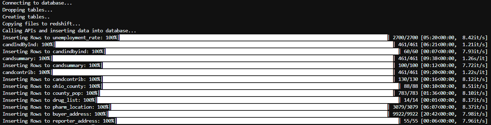

Photo by <a href="https://unsplash.com/@towfiqu999999?utm_source=unsplash&utm_medium=referral&utm_content=creditCopyText">Towfiqu barbhuiya</a> on <a href="https://unsplash.com/s/photos/pills?utm_source=unsplash&utm_medium=referral&utm_content=creditCopyText">Unsplash</a>

# ohio-opioid-analysis-database

WHAT IS THIS REPO AND PROJECT ALL ABOUT?

# Installation

# Usage

`~ python etl.py config.yaml`

# Files

+ etl.py
+ helper.py
+ sql_queries.py
+ config.yaml

# Data sources

## OpenSecrets Excel File

Upload the excel file for the dimension and fact tables

## OpenSecrets API

+ candindbyind
+ candsummary
+ candcontrib

## US Bureau of Labor Statiscs

https://stats.bls.gov/help/hlpforma.htm#EN
State and County Employment and Wages from Quarterly Census of Employment and Wages

## DEA Arcos Dataset

**arcospy**

## ETL Process

## Database Design Schema

candcontrib

Type | Column | Type
-----|--------|------
null | cand_name | varchar,
null | cid | varchar,
null | cycle | int,
null | origin | varchar,
null | source | varchar,
null | notice | varchar,
null | org_name | varchar,
null | total | int,
null | pacs | int,
null | indivs | int

buyer_address
Type | Column | Type
-----|--------|------
null | BUYER_DEA_NO | varchar,
null | BUYER_BUS_ACT | varchar,
null | BUYER_NAME | varchar,
null | BUYER_ADDRESS1 | varchar,
null | BUYER_ADDRESS2 | varchar,
null | BUYER_CITY | varchar,
null | BUYER_STATE | varchar,
null | BUYER_ZIP | int,
null | BUYER_COUNTY | varchar,
null | BUYER_ADDL_CO_INFO | varchar,

reporter_address
Type | Column | Type
-----|--------|------
null | Reporter_family | varchar,
null | REPORTER_DEA_NO | varchar,
null | REPORTER_BUS_ACT | varchar,
null | REPORTER_NAME | varchar,
null | REPORTER_ADDRESS1 | varchar,
null | REPORTER_CITY | varchar,
null | REPORTER_STATE | char(2),
null | REPORTER_ZIP | int,
null | REPORTER_COUNTY | varchar,

 county_raw
Type | Column | Type
-----|--------|------
FK | REPORTER_DEA_NO | varchar,
FK | BUYER_DEA_NO | varchar,
null | TRANSACTION_CODE | char(2),
null | DRUG_CODE | decimal,
null | NDC_NO | varchar,
null | DRUG_NAME | varchar,
null | QUANTITY | decimal,
null | UNIT | char(1),
null | ACTION_INDICATOR | char(1),
null | ORDER_FORM_NO | varchar,
null | CORRECTION_NO | decimal,
null | STRENGTH | decimal,
null | TRANSACTION_DATE | decimal,
null | CALC_BASE_WT_IN_GM | decimal,
null | DOSAGE_UNIT | decimal,
null | TRANSACTION_ID | decimal,
null | Product_Name | varchar,
null | Ingredient_Name | varchar,
null | Measure | varchar,
null | MME_Conversion_Factor | decimal,
null | Combined_Labeler_Name | varchar,
null | Revised_Company_Name | varchar,
null | Reporter_family | varchar,
null | dos_str | decimal,

drug_list
Type | Column | Type
-----|--------|------
null | DRUG_NAME | varchar

pharm_location
Type | Column | Type
-----|--------|------
PK | BUYER_DEA_NO | varchar
null | lat | decimal,
null | lon | decimal,

ohio_county
Type | Column | Type
-----|--------|------
null | BUYER_COUNTY | varchar,
null | BUYER_STATE | char(2),
null | countyfips | int

county_pop
Type | Column | Type
-----|--------|------
null | countyfips | int,
null | STATE | int,
null | COUNTY | int,
null | variable | varchar,
null | year | varchar,
null | population | int

candidate
Type | Column | Type
-----|--------|------
null | CID | varchar,
null | CRPName | varchar,
null | Party | varchar,
null | DistIDRunFor | varchar,
null | FECCandID | varchar,
null | metadata_sheet | varchar

crp_industry_codes
Type | Column | Type
-----|--------|------
null | Catcode | varchar,
null | Catname | varchar,
null | Carorder | varchar,
null | Industry | varchar,
null | Sector | varchar,
null | SectorLong | varchar,
null | metadata_sheet | varchar

crp_member
Type | Column | Type
-----|--------|------
null | CID | varchar,
null | CRPName | varchar,
null | Party | varchar,
null | Office | varchar,
null | FECCandID | varchar,
null | metadata_sheet | varchar

committee
Type | Column | Type
-----|--------|------
null | CODE | varchar,
null | CmteName | varchar,
null | metadata_sheet | varchar

expenditure_codes
Type | Column | Type
-----|--------|------
null | ExpCode | varchar,
null | DescripShort | varchar,
null | DescripLong | varchar,
null | Sector | varchar,
null | SectorName | varchar,
null | metadata_sheet | varchar

candIndbyInd
Type | Column | Type
-----|--------|------
null | cand_name | varchar,
null | cid | varchar,
null | cycle | int,
null | industry | varchar,
null | chamber | varchar,
null | party | varchar,
null | state | varchar,
null | total | int,
null | indivs | int,
null | pacs | int,
null | rank | int,
null | origin | varchar,
null | source | varchar, 
null | last_updated | date

candsummary
Type | Column | Type
-----|--------|------
null | cand_name | varchar,
null | cid | varchar,
null | cycle | varchar,
null | state | varchar,
null | party | varchar,
null | chamber | varchar,
null | first_elected | int,
null | next_election | int,
null | total | decimal,
null | spent | decimal,
null | cash_on_hand | decimal,
null | debt | decimal,
null | origin | varchar,
null | source | varchar,
null | last_updated | date

unemployment_rate
Type | Column | Type
-----|--------|------
null | series_id | varchar,
null | year | int,
null | period | char(3),
null | value | decimal,
null | footnotes | varchar

cw_area
Type | Column | Type
-----|--------|------
null | area_code | varchar,
null | area_name | varchar,
null | display_level | varchar,
null | selectable | varchar,
null | sort_sequence | int

cu_item
Type | Column | Type
-----|--------|------
null | item_code | varchar,
null | item_name | varchar,
null | display_level | varchar,
null | selectable | varchar,
null | sort_sequence | int

la_area
Type | Column | Type
-----|--------|------
null | area_type_code | char(1),
null | area_code | varchar,
null | area_text | varchar,
null | display_level | varchar,
null | selectable | varchar,
null | sort_sequence | int

la_area_type
Type | Column | Type
-----|--------|------
null | area_type_code | char(1),
null | areatype_text | varchar

la_measure
Type | Column | Type
-----|--------|------
null | measure_code | char(2),
null | measure_text | varchar
